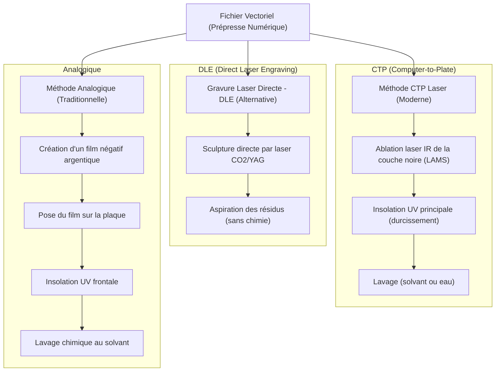

# La Flexographie : Dossier Technique & Pédagogique Complet

## Table des Matières
1. [Introduction](#introduction)
2. [Chapitre 1 : Les Origines & l'Évolution Historique](#chapitre-1-les-origines--lévolution-historique)
    - [1.1 L'invention de Carl Holweg (1890)](#11-linvention-de-carl-holweg-1890)
    - [1.2 L'époque de l'aniline (1890 - 1950)](#12-lépoque-de-laniline-1890---1950)
    - [1.3 Le tournant de 1952 et le Rebranding](#13-le-tournant-de-1952-et-le-rebranding)
3. [Chapitre 2 : La Mécanique de la Presse Flexographique](#chapitre-2-la-mécanique-de-la-presse-flexographique)
    - [2.1 Architecture d'un groupe d'impression](#21-architecture-dun-groupe-dimpression)
    - [2.2 Le trajet de l'encre en 4 étapes clés](#22-le-trajet-de-lencre-en-4-étapes-clés)
    - [2.3 Les paramètres clés de l'Anilox](#23-les-paramètres-clés-de-lanilox)
4. [Chapitre 3 : Le Prépresse & la Confection de la Forme Imprimante](#chapitre-3-le-prépresse--la-confection-de-la-forme-imprimante)
    - [3.1 Le photopolymère : chimie de base](#31-le-photopolymère--chimie-de-base)
    - [3.2 La méthode analogique (Traditionnelle)](#32-la-méthode-analogique-traditionnelle)
    - [3.3 La méthode numérique CTP (Computer-to-Plate)](#33-la-méthode-numérique-ctp-computer-to-plate)
    - [3.4 La Gravure Laser Directe (DLE - Direct Laser Engraving)](#34-la-gravure-laser-directe-dle---direct-laser-engraving)
5. [Chapitre 4 : Encres et Substrats (Supports)](#chapitre-4-encres-et-substrats-supports)
    - [4.1 Les trois grandes familles d'encres](#41-les-trois-grandes-familles-dencres)
    - [4.2 Les substrats et la polyvalence de la flexographie](#42-les-substrats-et-la-polyvalence-de-la-flexographie)
6. [Chapitre 5 : Comparatif des Procédés (Flexo vs Offset vs Héliogravure)](#chapitre-5-comparatif-des-procédés-flexo-vs-offset-vs-héliogravure)
    - [5.1 Tableau comparatif industriel](#51-tableau-comparatif-industriel)
    - [5.2 Analyse économique et technique](#52-analyse-économique-et-technique)
7. [Chapitre 6 : Avenir, Innovation et Écologie](#chapitre-6-avenir-innovation-et-écologie)
    - [6.1 Pressions réglementaires (PPWR)](#61-pressions-réglementaires-ppwr)
    - [6.2 Les avancées de la Flexo HD (FlatTop Dots)](#62-les-avancées-de-la-flexo-hd-flattop-dots)
    - [6.3 La transition vers l'économie circulaire](#63-la-transition-vers-léconomie-circulaire)

---

## Introduction

La **flexographie** est un procédé d'impression direct en relief utilisant des formes imprimantes souples (clichés photopolymères ou en caoutchouc vulcanisé). Majoritairement employée dans le secteur de l'emballage, elle s'est imposée comme le procédé industriel dominant (environ 70 % de parts de marché mondial de l'emballage) en raison de sa flexibilité, de sa rapidité et de son adaptabilité à une variété presque infinie de supports.

Ce dossier technique a pour but de détailler l'ensemble des aspects historiques, mécaniques, chimiques et environnementaux du procédé flexographique, en servant de support de cours et de référence approfondie pour la présentation du projet.

---

## Chapitre 1 : Les Origines & l'Évolution Historique

### 1.1 L'invention de Carl Holweg (1890)
La flexographie trouve ses racines à la fin du XIXe siècle, période marquée par l'essor de la production industrielle et l'émergence des commerces de détail nécessitant des solutions d'emballage personnalisées. 

En **1890**, l'imprimeur et inventeur allemand **Carl Holweg** dépose un brevet pour une presse rotative capable d'imprimer sur des sacs en papier à l'aide de plaques en caoutchouc souple vulcanisé. La grande rupture technologique réside dans le fait que la forme imprimante n'est plus métallique ou rigide (comme en typographie traditionnelle ou en lithographie), mais **flexible**. Cette souplesse permettait d'imprimer sur des surfaces irrégulières et rugueuses (comme le papier kraft épais) sans déchirer le support ni écraser les fibres.

### 1.2 L'époque de l'aniline (1890 - 1950)
Pour alimenter ce nouveau procédé, l'industrie a recours à des encres à base d'**aniline** ($C_6H_5NH_2$), un composé organique dérivé du goudron de houille.
* **Avantages :** Ces encres offraient un séchage physique extrêmement rapide par évaporation des solvants, une excellente adhérence sur les supports lisses et non poreux, et un coût de fabrication dérisoire.
* **Inconvénients :** L'aniline s'avère hautement toxique par inhalation et contact cutané (liée à des risques de méthémoglobinémie et de cancer). De plus, les solvants organiques volatils dégageaient des vapeurs nocives dans les ateliers de production.

En **1949**, la Food and Drug Administration (FDA) aux États-Unis prononce une interdiction partielle de l'usage des encres à base d'aniline pour la fabrication des emballages alimentaires en contact direct. Cette décision a plongé le secteur dans une crise de réputation majeure, le terme "impression à l'aniline" devenant synonyme de danger sanitaire.

### 1.3 Le tournant de 1952 et le Rebranding
Face à cette menace de disparition, les professionnels du secteur se réunissent lors du congrès de la *Packaging Institute* à Chicago en **1952** afin de redéfinir l'identité du procédé.

Un vote est organisé pour rebaptiser le procédé. Trois noms principaux étaient proposés :
1. *Permaprint*
2. *Rotoplate*
3. *Flexographie* (dérivé du latin *flexus*, signifiant courbé ou pliable, et du grec *graphein*, écrire).

Le nom **Flexographie** est officiellement adopté. Ce changement de sémantique s'est accompagné d'une refonte technique complète : abandon définitif des colorants à l'aniline au profit de pigments organiques et synthétiques non toxiques dispersés dans de nouveaux liants résineux. Ce rebranding et ces avancées hygiéniques ont permis de relancer l'expansion du marché de l'emballage.

---

## Chapitre 2 : La Mécanique de la Presse Flexographique

### 2.1 Architecture d'un groupe d'impression
Une presse flexographique moderne est constituée de plusieurs groupes d'impression (couleurs) synchronisés. Il existe trois configurations de presse principales :
* **Presse à tambour central (CI - Central Impression) :** Les différents groupes de couleurs sont disposés autour d'un unique grand cylindre de contre-pression central. Cette architecture est idéale pour les supports fins et extensibles (films plastiques), car le substrat reste plaqué contre le tambour durant tout le cycle, évitant les défauts de repérage des couleurs.
* **Presse en ligne (Inline) :** Les groupes d'impression sont disposés horizontalement l'un à la suite de l'autre. Elle est privilégiée pour les supports rigides (carton ondulé) ou les étiquettes complexes nécessitant des modules de découpe intégrés.
* **Presse à groupes superposés (Stack) :** Les groupes sont empilés verticalement. Moins encombrante, elle est utilisée pour les tirages simples ou le vernissage.

### 2.2 Le trajet de l'encre en 4 étapes clés

```mermaid
flowchart LR
    A["Bac à encre / Chambre à racle"] -->|Alimentation| B["Cylindre Anilox (Gravé céramique)"]
    B -->|Essuyage par Doctor Blade / Racle| B
    B -->|Encrage sélectif du relief| C["Cylindre Porte-Cliché (Plaque souple)"]
    C -->|Transfert par pression douce (Kiss Impression)| D["Substrat (Matériau à imprimer)"]
    E["Cylindre de Contre-Pression (Appui)"] -.->|Pression régulée| D
```

1. **Le bac à encre / Le système d'alimentation :** L'encre liquide est acheminée depuis un réservoir vers la presse. Dans les systèmes modernes, on utilise une **chambre à racle fermée** (deux lames métalliques encadrant une cavité pressurisée) posée contre l'anilox, ce qui évite l'évaporation des solvants et assure un approvisionnement constant.
2. **Le cylindre Anilox (La pièce maîtresse) :** Cylindre métallique revêtu d'une couche céramique ultra-dure (oxyde de chrome) gravée au laser de millions de micro-alvéoles (cellules en nid d'abeille). La racle (*doctor blade*) en acier ou plastique essuie l'excès d'encre à la surface de l'anilox pour ne conserver de l'encre que dans les alvéoles.
3. **Le cliché en relief :** L'anilox entre en contact avec la plaque photopolymère souple montée sur le cylindre porte-cliché. Seules les zones en relief (qui représentent le graphisme à imprimer) viennent capter l'encre contenue dans les alvéoles de l'anilox. Les zones en creux restent vierges de toute encre.
4. **Le transfert sur le substrat :** Le substrat défile entre le cylindre porte-cliché et un cylindre de contre-pression métallique poli. L'encre est transférée par contact léger (nommé *kiss impression* ou pression tangentielle douce). L'encre sèche quasi-instantanément sous des systèmes de séchage à air chaud, infrarouge ou lampes UV. La vitesse de défilement peut atteindre **600 mètres par minute** sur les presses industrielles modernes.

### 2.3 Les paramètres clés de l'Anilox
Le cylindre anilox régit la quantité d'encre déposée sur le cliché. Il se caractérise par deux variables fondamentales :
* **La linéature (exprimée en L/cm ou LPI - Lignes par pouce) :** Nombre d'alvéoles par unité de longueur. Plus la linéature est élevée (ex. 800 à 1200 LPI), plus les alvéoles sont petites et rapprochées, permettant d'imprimer des détails fins et des dégradés complexes (quadrichromie). Une linéature basse (ex. 100 à 250 LPI) est réservée aux gros aplats de couleur et aux vernis.
* **Le volume d'apport (exprimé en $cm^3/m^2$ ou BCM - Billion Cubic Microns par pouce carré) :** Capacité volumique totale des alvéoles. Il doit être rigoureusement calibré : un excès d'encre produit un empâtement des points (dot gain), tandis qu'un volume insuffisant altère la densité optique de la couleur.

---

## Chapitre 3 : Le Prépresse & la Confection de la Forme Imprimante

La fabrication d'un cliché flexographique consiste à convertir un fichier numérique vectoriel en un relief physique 3D. Cette étape est passée d'un procédé purement chimique et analogique à un flux entièrement numérique.

### 3.1 Le photopolymère : chimie de base
Les clichés modernes sont composés de plaques de **photopolymère photosensible**. Ces plaques contiennent des élastomères de synthèse, des monomères réactifs et des photo-initiateurs.
Sous l'influence d'un rayonnement ultraviolet (UV-A d'une longueur d'onde de $350-380\text{ nm}$), les photo-initiateurs absorbent les photons et génèrent des radicaux libres. Ces radicaux déclenchent une réaction de polymérisation en chaîne (réticulation) qui convertit les monomères liquides ou pâteux en un réseau tridimensionnel solide et insoluble.

### 3.2 La méthode analogique (Traditionnelle)
Le flux traditionnel repose sur l'utilisation d'un film intermédiaire :
1. **Insolation dorsale (pré-insolation) :** Exposition de la plaque par le dos (sans masque) aux UV-A pour durcir une épaisseur de base uniforme, appelée le **talon**, définissant la hauteur finale du relief.
2. **Insolation principale (frontale) :** On applique un film négatif argentique sur la face supérieure de la plaque. L'ensemble est insolé sous vide. Les rayons UV traversent les zones transparentes du film, polymérisant et durcissant le relief imprimant. Les zones noires et opaques bloquent la lumière.
3. **Gravure (Lavage chimique) :** La plaque est brossée mécaniquement dans un bain de solvants organiques ou d'eau additionnée de détergents. Les parties non polymérisées (restées molles) sont dissoutes et éliminées.
4. **Séchage :** La plaque est placée dans un four ventilé ($50-60^\circ\text{C}$) pour évaporer le solvant absorbé par le photopolymère.
5. **Traitement final :** Exposition à des UV-C pour éliminer le collant de surface, puis insolation de post-durcissement aux UV-A.

### 3.3 La méthode numérique CTP (Computer-to-Plate)
Le procédé CTP élimine l'utilisation de films négatifs argentiques physiques :
* La plaque photopolymère est recouverte en usine d'une couche noire de carbone opaque très fine (masque **LAMS** - *Laser Ablative Mask System*).
* Un imageur laser infrarouge ($830\text{ nm}$) grave directement les motifs en vaporisant la couche LAMS. Les zones gravées deviennent transparentes.
* Les étapes d'insolation UV, lavage et séchage sont identiques. L'absence de film élimine les phénomènes de diffusion de la lumière entre le film et la plaque, garantissant des bords de points plus nets et des points de trame extrêmement fins (linéatures de 150 à 200 LPI, taille de point jusqu'à $1\text{ micron}$).

### 3.4 La Gravure Laser Directe (DLE - Direct Laser Engraving)
La technologie DLE constitue l'alternative écologique ultime :
* Utilisation d'une plaque en caoutchouc synthétique vulcanisé ou en élastomère stable.
* Un laser de puissance (CO2 ou YAG) brûle et grave directement les zones creuses du cliché à partir du fichier numérique.
* **Avantages :** Zéro chimie, aucun lavage, pas de solvants, aucune déformation dimensionnelle de la plaque liée au gonflement chimique.



---

## Chapitre 4 : Encres et Substrats (Supports)

### 4.1 Les trois grandes familles d'encres

| Type d'encre | Composition typique | Mode de séchage | Avantages | Contraintes / Limites |
| :--- | :--- | :--- | :--- | :--- |
| **À base d'eau (Aqueuse)** | Pigments, résines acryliques, eau ($60-80\%$), additifs (amines). | Physique (Évaporation forcée par air chaud / IR). | Faibles émissions de COV, inodore, économique, idéale pour supports poreux. | Séchage plus lent que les solvants, pH-métrie à surveiller en machine. |
| **À base de solvant** | Pigments, résines synthétiques (nitrocellulose, polyuréthane), solvants organiques (éthanol, acétate d'éthyle). | Physique rapide (Évaporation par air chaud pulsé). | Excellente adhésion sur films non poreux, séchage ultra-rapide. | Émission importante de COV, nécessité de captage/recyclage, normes de sécurité strictes (ATEX). |
| **UV / UV-LED** | Pigments, oligomères réactifs, monomères diluants, photo-initiateurs. | Chimique (Polymérisation instantanée sous exposition UV / UV-LED). | Extrait sec de $100\%$ (zéro solvant), brillance élevée, résistance physique élevée, pas de séchage sur l'anilox. | Coût élevé de l'encre, irritation cutanée potentielle lors de la manipulation des monomères libres. |

> [!TIP]
> **La révolution UV-LED :** Les lampes UV classiques au mercure produisent de l'ozone (toxique) et consomment une énergie considérable. Les systèmes UV-LED actuels émettent une longueur d'onde étroite ($365$ ou $395\text{ nm}$), s'allument instantanément sans temps de préchauffage, ne dégagent pas d'ozone, et réduisent la consommation électrique de la presse de **$60$ à $80\%$**.

### 4.2 Les substrats et la polyvalence de la flexographie
La flexographie s'adapte à de multiples supports grâce à la souplesse de ses clichés qui épousent les irrégularités de surface :
* **Supports poreux et épais :** Carton ondulé (boîtes d'expédition), papiers kraft, cartons plats (briques de lait, étuis pliants).
* **Films plastiques souples non poreux :** Polyéthylène (PE), Polypropylène bi-orienté (BOPP), Polyester (PET).
* **Autres :** Feuilles d'aluminium (opercules de yaourt), complexes métallisés, étiquettes adhésives et films rétractables (*sleeves*).

> [!NOTE]
> **Le traitement Corona :** Les films plastiques possèdent une tension superficielle naturelle basse qui empêche l'encre humide de s'étaler et d'adhérer correctement. Avant l'impression, les films subissent en ligne un **traitement Corona** (décharge électrique haute tension) qui oxyde la surface du plastique et augmente sa polarité pour assurer l'accroche de l'encre.

---

## Chapitre 5 : Comparatif des Procédés (Flexo vs Offset vs Héliogravure)

### 5.1 Tableau comparatif industriel

| Critère | Flexographie (Classique & HD) | Offset Lithographique | Héliogravure (Rotogravure) |
| :--- | :--- | :--- | :--- |
| **Principe de la forme** | Relief souple (photopolymère). | Plan (séparation eau / encre grasse). | Creux (cylindre métallique gravé). |
| **Coût moyen d'une plaque / couleur** | **$200$ à $800\text{ €}$** | **$15$ à $50\text{ €}$** | **$3\ 000$ à $10\ 000\text{ €}$** |
| **Tirage minimum rentable** | Moyen à long ($1\ 000\text{ m}$ à $10\ 000\text{ m}$). | Court à moyen ($500$ à $5\ 000$ feuilles). | Très long ($>100\ 000\text{ m}$). |
| **Vitesse d'impression** | Élevée (jusqu'à $600\text{ m/min}$). | Moyenne ($15\ 000\text{ f/h}$ ou $\approx 250\text{ m/min}$). | Très élevée (jusqu'à $1000\text{ m/min}$). |
| **Supports compatibles** | Tous supports (films plastiques, cartons ondulés, métaux, papiers). | Papiers et cartons plats rigides uniquement. | Papiers de haute qualité, films plastiques fins. |
| **Finesse de trame** | Excellente en Flexo HD (jusqu'à $200\text{ LPI}$). | Inégalée (trame stochastique ou classique fine). | Exceptionnelle (mais effet "dents de scie" sur les textes). |
| **Temps de calage machine** | Modéré à rapide. | Très rapide (sur presse feuilles). | Très long et complexe. |

### 5.2 Analyse économique et technique
Chaque procédé répond à un besoin spécifique :
1. **L'Offset** brille par sa qualité photographique sur papier et carton plat (brochures, livres, affiches). Cependant, il est structurellement incapable d'imprimer sur du carton ondulé épais (le carton serait écrasé sous la pression des cylindres rigides) ou sur des bobines de films plastiques extensibles fins.
2. **L'Héliogravure** offre une régularité de couleur absolue pour les tirages pharaoniques (ex. emballage de grandes marques agroalimentaires diffusées à l'échelle mondiale). Cependant, le coût faramineux de gravure et de galvanoplastie des cylindres massifs en cuivre/chrome la rend économiquement prohibitive pour les tirages de taille moyenne.
3. **La Flexographie** s'impose comme le compromis gagnant : le coût de sa forme imprimante reste accessible pour des séries personnalisées ou moyennes, sa vitesse égale presque celle de l'hélio, et elle accepte tous les matériaux.

---

## Chapitre 6 : Avenir, Innovation et Écologie

L'industrie graphique et de l'emballage est confrontée à une mutation réglementaire sans précédent.

### 6.1 Pressions réglementaires (PPWR)
En Europe, le règlement **PPWR** (*Packaging and Packaging Waste Regulation*) impose des objectifs drastiques d'ici 2030 :
* Réduction générale du suremballage.
* Obligation d'incorporer des matériaux recyclés dans les plastiques d'emballage.
* Transition massive vers des mono-matériaux faciles à recycler (ex. remplacer les complexes multicouches PET/Alu/PE par des structures monocouches de PE).
Les presses flexo doivent par conséquent être capables de guider et d'imprimer des films mono-matériaux très fins et extensibles sans déformation du repérage d'impression.

### 6.2 Les avancées de la Flexo HD (FlatTop Dots)
Historiquement, la flexographie souffrait d'un défaut mécanique appelé l'**élargissement du point** (*dot gain*). Sous la pression de transfert, le sommet arrondi des points de trame s'écrasait, assombrissant l'image imprimée.

```
Point standard (Sommet arrondi inhibé par l'oxygène) :
      ___
    /     \      <-- S'écrase sous la pression (Dot Gain élevé)
   /       \

Point FlatTop (Sommet plat / Réticulation totale) :
    |-------|
    |       |    <-- Résiste à l'écrasement (Rendu précis des tons)
    /       \
```

La technologie **FlatTop Dots** (points à sommet plat) résout ce problème en insolant la plaque sous atmosphère d'azote inerte (pour exclure l'oxygène de l'air qui inhibe la réticulation de surface) ou en laminant un film barrière à l'oxygène. Les points obtenus possèdent des sommets plats et des flancs abrupts qui résistent aux variations de pression d'impression, garantissant une finesse de rendu équivalente à l'héliogravure.

### 6.3 La transition vers l'économie circulaire
La flexographie intègre de nombreuses innovations écologiques :
* **Valorisation des déchets :** Les clichés en photopolymères usagés sont recyclés, et les solvants de nettoyage sont distillés et réutilisés en circuit fermé.
* **Systèmes de contrôle par IA :** L'intégration de caméras d'inspection linéaire ($100\%$ vision machine) dotées d'algorithmes d'IA permet de comparer en temps réel l'impression en cours avec le fichier PDF prépresse. La presse corrige automatiquement sa pression et ses repères, réduisant la gâche matière (papier/plastique) de **$70\%$** lors de la phase de calage.
* **Encres végétales :** Remplacement des huiles minérales par des huiles de soja ou de lin dans les véhicules des encres, tendant vers un objectif de neutralité carbone.

---

*Dossier rédigé dans le cadre des travaux de recherche de la classe 108 par Chohaib Soufiane, Oualid Driwch, Abdllah Amhil et Bafrij Ilyass. Sous la direction de Mme Batioui.*
